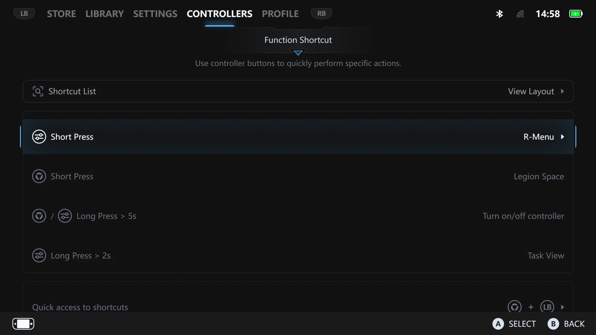
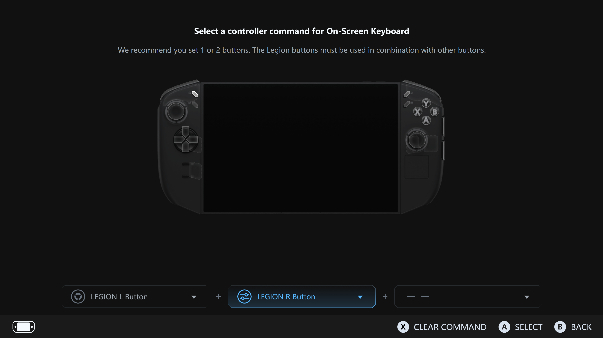
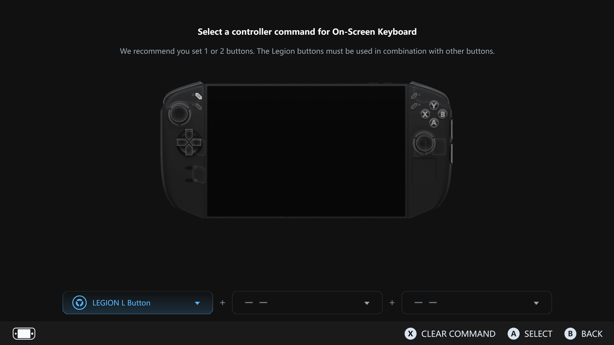
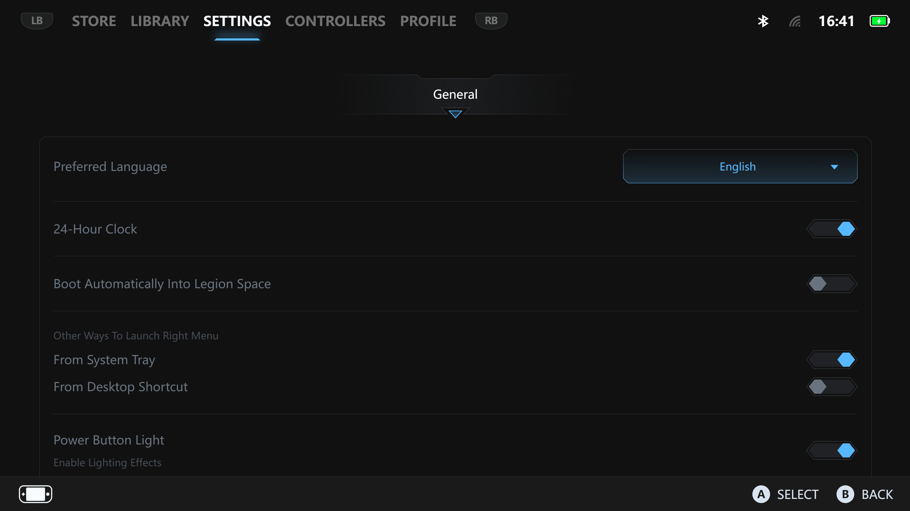

# LegionSpace-LegionKey-Patch

Unofficial patch that frees the **Legion&nbsp;L** ("Legion Space") button on the **Lenovo Legion&nbsp;Go** so it can be assigned **by itself** in Legion Space's *Controllers → Function Shortcut* menu — something the stock UI blocks.

> **Tested on:** Legion&nbsp;Go 8ASP2 (model 83N0), Legion Space **1.4.4.21**.
> The patch matches code **by content, not by filename/version**, so it has a good chance of working across other Legion&nbsp;Go models and Legion Space builds.

> ⚠️ **Disclaimer:** This modifies files inside your Legion Space installation. It is **unofficial** and **not affiliated with or endorsed by Lenovo**. Use at your own risk. Every change is backed up (`*.bak`) and fully reversible (`-Restore`).

<!-- IMAGE (hero): the Controllers > Function Shortcut screen.
     Save as: docs/images/function-shortcut.png -->


---

## What it does

By default, Legion Space reserves the Legion&nbsp;L button (short press → opens Legion Space) and **will not let you assign a Function Shortcut to a Legion button on its own** — it forces you to combine it with another button (e.g. *On-Screen Keyboard = Legion&nbsp;Space&nbsp;+&nbsp;B*). This patch makes two changes:

1. **Frees the Legion&nbsp;L button** — you can now bind a Function Shortcut to *just* Legion&nbsp;Space (short press).
2. **Relabels the misleading row** — the fixed, non-editable **"Short Press → Legion Space"** reference row changes to **"Check quick access shortcuts below"** *only* once Legion&nbsp;L has been rebound, so the menu stops contradicting itself.

| Before | After |
| --- | --- |
| <!-- IMAGE: stock menu, lone Legion Space rejected ("Setup failed"). docs/images/before.png -->  | <!-- IMAGE: a function bound to just Legion Space; row reads "Check quick access shortcuts below". docs/images/after.png -->  |

---

## Why a patch is needed

Legion Space is a Chromium (CEF) + .NET app. The Legion&nbsp;L/R buttons are **not keyboard keys** — they arrive over the controllers' vendor HID protocol and are handled by Legion Space's background service (`DAService` → `LSDaemon.exe`). That means ordinary key remappers (PowerToys, AutoHotkey, SharpKeys) **can't see them**.

The "you can't bind a lone Legion button" rule turned out to be a **client-side guard in Legion Space's own web UI**, not a hardware limit — so the fix is a small, surgical edit to that UI bundle.

---

## Requirements

- Lenovo Legion&nbsp;Go with Legion Space installed
- Windows **PowerShell, run as Administrator**

---

## Usage

1. Download / clone this repo.
2. Open **PowerShell as Administrator**.
3. Run:

```powershell
cd "$env:USERPROFILE\Documents\LegionSpace-LegionKey-Patch"
powershell -ExecutionPolicy Bypass -File .\Patch-LegionKey.ps1
```

The script stops nothing critical: it edits the loose UI file and bounces only the Legion Space **window** (the daemon relaunches it), so your controllers stay connected. It backs up each file to `*.bak` before editing and is **idempotent** (safe to run again — it does nothing if already applied).

Then, in Legion Space: **Controllers → Function Shortcut**, pick a function, and set its key to **just Legion&nbsp;Space** (remove the second key). It will now save.

### Options

| Flag | What it does |
| --- | --- |
| *(none)* | Free **Legion&nbsp;L** only (Legion&nbsp;R stays reserved) + relabel the row. |
| `-FreeBoth` | Free **both** Legion&nbsp;L and Legion&nbsp;R for standalone binding. |
| `-Restore` | Roll back every change from the `*.bak` backups. |
| `-NoStop` | Don't bounce the UI (you reopen Legion Space yourself). |
| `-InstallTask` | Register a scheduled task that **re-applies the patch after Legion Space updates** (see below). |
| `-UninstallTask` | Remove that scheduled task. |
| `-InstallRoot <path>` | Override the install location (default `C:\Program Files\Lenovo\LegionSpace`). |

---

## ⭐ Important: stop the key from seeming "dead" at boot

After binding the Legion&nbsp;L button, you may find it does nothing right after a reboot. This is **not** the patch failing — it's because **"Boot automatically into Legion Space"** opens the Legion Space window in the foreground, and that window **swallows the first button press** until it's dismissed. The daemon (and therefore your remap) runs either way.

**Fix:** in Legion Space settings, turn **OFF** *"Boot automatically into Legion Space"*. Then the remap fires immediately from boot.

<!-- IMAGE: the "Boot automatically into Legion Space" toggle set to Off.
     Save as: docs/images/boot-auto-setting.png -->


---

## Make it survive Legion Space updates

Legion Space auto-updates **wipe this patch** — each update installs a brand-new version folder, so the edited files are gone. To re-apply automatically:

```powershell
powershell -ExecutionPolicy Bypass -File .\Patch-LegionKey.ps1 -InstallTask
```

This registers a scheduled task (`LegionSpace-LegionKeyPatch`) that runs at **logon and startup** as SYSTEM and re-applies the patch if it's missing. It's idempotent, so it does nothing when the patch is already present. Remove it any time with `-UninstallTask`.

> Note: the task triggers at logon/startup, so if an update lands **mid-session** the patch is gone until your next reboot (or a manual re-run).

---

## How to undo everything

```powershell
powershell -ExecutionPolicy Bypass -File .\Patch-LegionKey.ps1 -Restore
# and, if you installed it:
powershell -ExecutionPolicy Bypass -File .\Patch-LegionKey.ps1 -UninstallTask
```

---

## How it works (technical)

Both edits are in Legion Space's web bundle, under `…\LegionSpace\<version>\HTML\js\` (filenames are content-hashed and change every version, so the script finds them by content):

1. **Free the Legion button** — the shortcut-commit guard
   ```js
   if ((o.includes(1) || o.includes(2)) && o.length === 1) { reject() }   // id 1 = Legion L, 2 = Legion R
   ```
   is changed from `o.includes(1)||o.includes(2)` to `o.includes(2)`, so a lone Legion&nbsp;L (id&nbsp;1) is accepted.

2. **Relabel the reference row** — the computed that builds the fixed reference list is wrapped so the `id:2` row's text becomes *"Check quick access shortcuts below"* only when Legion&nbsp;L is bound standalone, and stays *"Legion Space"* otherwise.

The script never stops the `DAService` daemon (doing so drops the controller handshake and triggers a "connect controllers" prompt); it only bounces the UI window, and relies on the edited file's new timestamp to invalidate the CEF/V8 code cache.

---

## Contributing / other models

If you run a different Legion&nbsp;Go model or Legion Space version and it works (or doesn't), please open an issue with your model number and Legion Space version. Screenshots welcome — drop them in `docs/images/`.
